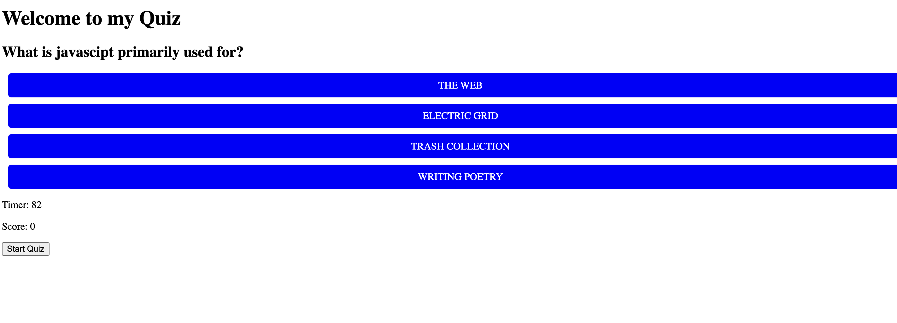

# Challenge4_Quiz
Make a Quiz with certain parameters from scratch using HTML, CSS and JS.  Deduct time for an incorrect answer, add points for correct answer, save initials with score to local storage.

# Making a quiz from scratch

## Description

The purpose of this challenge was to make a portfolio website using advanced CSS that we have learned in class.  This page had some complex CSS but using tools like Flexbox made it much more possible.

## Table of Contents

## Installation

Access code on github and run the website on a browser.

## Usage

Take a quiz to see your knowledge of javascript.

## Credits

Ilya Feldman.

## License

None.
---

